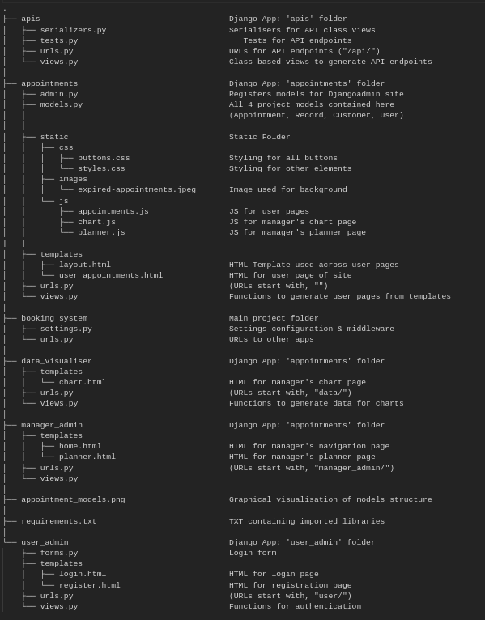

# Harvard Online's CS50 Web Programming with Python and Javascript 2023: Capstone

## Booking System: ["Nails by Victoria"](https://youtu.be/ip4UhV5GwHE)

This project presents a solution to a real world business problem. 

The imagined client is a small beautician/salon that markets their services through social media.
All appointments are advertised through instagram and bookings are taken and confirmed individually.
The service they offer is great, but the administration is very time consuming!

I have created an appointment booking system for them: essentially a time saving service. It allows all
bookings to be created and managed independently. It presents a simple and intuitive user interface for customers as a SPA (Single Page Application). Customers can use the booking system that changes content dynamically, without the need for page reloads. Customers can select an upcoming appointment, choose the service they desire and then view it on their personalised page. Here they can also request cancellation of an upcoming scheduled appointment.

The 'manager admin' area enables a user with administrator privileges to schedule future appointments and to view records of past appointments. These appointment records are ideal for keeping a paper trail of the business's work for audit purposes. Graphical visualisations of records data reveal how the business progresses over time.

## Distinctiveness and Complexity:

Although the appointment booking system, by necessity implements much of the content of CS50W lectures, it is altogether a different sort of web application, with different features than those required for the other assignments.

The site makes use of several tools and libraries outside of the CS50W lecture content, in particular:

-Django Rest Framework: to create API endpoints for CRUD operations.

-Python Pandas: to manipulate appointment records data for audit purposes.

-Chart JS library: to render graphical representations of appointment records data.

The site is built upon 5 seperate django apps, namely:

-Appointments

-APIs

-Data Visualiser

-Manager Admin

-User Admin

This allows the site's features to be seperated into small components, making it easier to manage.
This structure would allow changes, enhancements, optimisations and new features to be made in the future.

## File Structure:

## How to run application:

Run application in virtual environment:

`python3 -m venv testvenv`

`source source testvenv/bin/activate`

Install dependencies:

`pip install -r requirements.txt`

Create database migration files:

`py manage.py makemigrations`

Update database schema:

`py manage.py migrate`

Create superuser:

`py manage.py createsuperuser`

Run local server:

`./manage.py runserver`

## Comments on design:

I designed this app primarily with the focus of creating a robust back end, with APIs used for all CRUD operations on the customer facing aspects of the site. On the manager's pages of the site I chose to use mainly django functions, as these would be more likely to have to change as the site is updated according to the manager's needs. For this reason too I have not implemented the SPA approach for the manager's pages, as these are subject to change and would likely only ever be accessed by 1 or 2 admin users.

I chose to use only bog-standard (vanilla) Javascript to create this site. This was a conscious choice so that I coulId become better aquainted with DOM manipulation in JS before going on to learn other front end libraries. An obvious improvement for this site would therefore be to implement a modern front end JS framework such as React or Angular.

## Future Adaptations:

### For Manager's Area:
-Improved appointment planner, with a tick box form for more accurate appointment scheduling

-Options to provide expenses as records for a more comprehensive audit trail

-Dynamic chart rendering, so that managers can set date parameters on chart views 

### For Customers' Area:
-Automated SMS messaging to give booking confirmations and alerts for their scheduled appointments

-Integration with a payments system so that bookings require deposits, or the option to pay in advance

-A messaging system for customers to contact managers directly, or specify their preferences for services (e.g. what styles/ colours they would like)

-A feedback form to survey user experience

-Integration with 3rd party APIs to enable social media logins

## Thanks 

Through building this site I have learned a great deal about web design and software development more generally. I would like to express a word of gratitude to Brian Yu for his excellent teaching and to whoever is responsible for the grading and review of submissions, cheers. Thanks also to the creator of [this cool button](https://codepen.io/ash_creator/pen/oNyNbNO), which I adapted for my purposes as compliments the aesthetic of the site perfectly.

